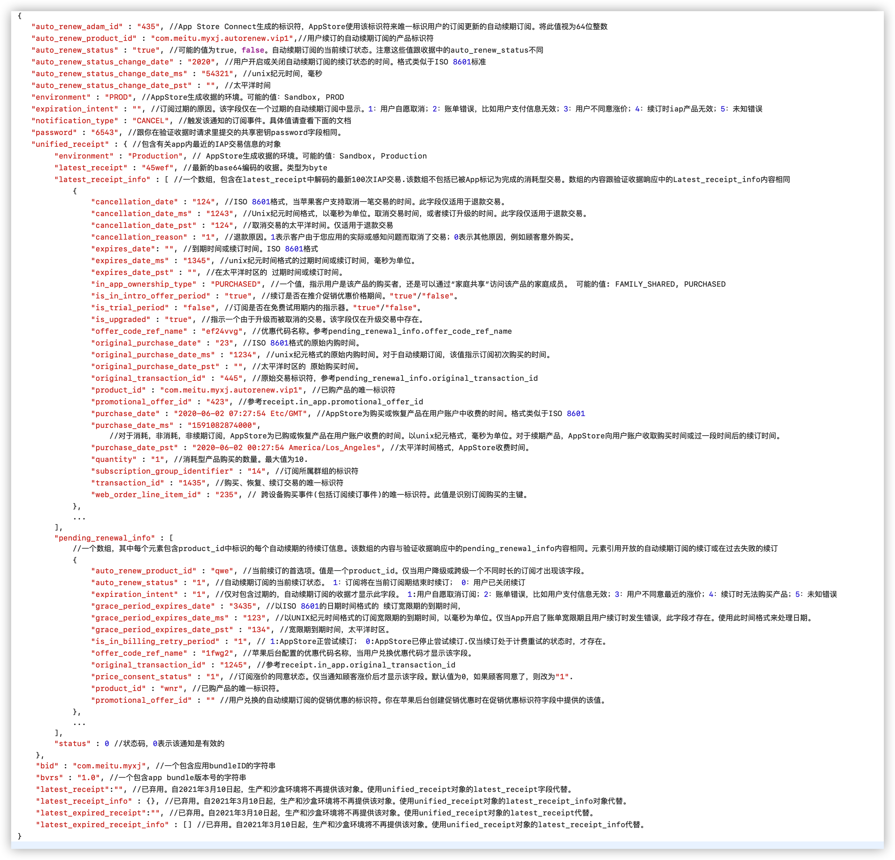

# IAP 服务器通知的解释

原文请查看[App Store服务器通知](https://developer.apple.com/documentation/appstoreservernotifications/responsebody)

**注意：** 该文档校对于`2021-03-16`，如苹果在之后更新官网文档，可能会有细节差异，请注意比对。

来自App Store服务器通知的数据格式，以及字段含义解释如下：

```
{
    "auto_renew_adam_id" : "435", //App Store Connect生成的标识符，AppStore使用该标识符来唯一标识用户的订阅更新的自动续期订阅。将此值视为64位整数
    "auto_renew_product_id" : "com.meitu.myxj.autorenew.vip1",//用户续订的自动续期订阅的产品标识符
	"auto_renew_status" : "true", //可能的值为true，false。自动续期订阅的当前续订状态。注意这些值跟收据中的auto_renew_status不同
	"auto_renew_status_change_date" : "2020", //用户开启或关闭自动续期订阅的续订状态的时间。格式类似于ISO 8601标准
	"auto_renew_status_change_date_ms" : "54321", //unix纪元时间，毫秒
	"auto_renew_status_change_date_pst" : "", //太平洋时间
	"environment" : "PROD", //AppStore生成收据的环境。可能的值：Sandbox, PROD
	"expiration_intent" : "", //订阅过期的原因。该字段仅在一个过期的自动续期订阅中显示。1：用户自愿取消；2：账单错误，比如用户支付信息无效；3：用户不同意涨价；4：续订时iap产品无效；5：未知错误
	"notification_type" : "CANCEL", //触发该通知的订阅事件。具体值请查看下面的文档
	"password" : "6543", //跟你在验证收据时请求里提交的共享密钥password字段相同。
	"unified_receipt" : { //包含有关app内最近的IAP交易信息的对象 
        "environment" : "Production", // AppStore生成收据的环境。可能的值：Sandbox, Production
        "latest_receipt" : "45wef", //最新的base64编码的收据。类型为byte
        "latest_receipt_info" : [ //一个数组，包含在latest_receipt中解码的最新100次IAP交易.该数组不包括已被App标记为完成的消耗型交易。数组的内容跟验证收据响应中的Latest_receipt_info内容相同
                                   {
							                "cancellation_date" : "124", //ISO 8601格式，当苹果客户支持取消一笔交易的时间。此字段仅适用于退款交易。
							                "cancellation_date_ms" : "1243", //Unix纪元时间格式，以毫秒为单位。取消交易时间，或者续订升级的时间。此字段仅适用于退款交易。
							                "cancellation_date_pst" : "124", //取消交易的太平洋时间。仅适用于退款交易
							                "cancellation_reason" : "1", //退款原因。1表示客户由于您应用的实际或感知问题而取消了交易；0表示其他原因，例如顾客意外购买。
							                "expires_date": "", //到期时间或续订时间。ISO 8601格式
							                "expires_date_ms" : "1345", //unix纪元时间格式的过期时间或续订时间，毫秒为单位。
							                "expires_date_pst" : "", //在太平洋时区的 过期时间或续订时间。
							                		     "in_app_ownership_type" : "PURCHASED", //一个值，指示用户是该产品的购买者，还是可以通过“家庭共享”访问该产品的家庭成员。 可能的值: FAMILY_SHARED, PURCHASED
							                "is_in_intro_offer_period" : "true", //续订是否在推介促销优惠价格期间。"true"/"false"。
							                "is_trial_period" : "false", //订阅是否在免费试用期内的指示器。"true"/"false"。
							                "is_upgraded" : "true", //指示一个由于升级而被取消的交易。该字段仅在升级交易中存在。
							                "offer_code_ref_name" : "ef24vvg", //优惠代码名称。参考pending_renewal_info.offer_code_ref_name
							                "original_purchase_date" : "23", //ISO 8601格式的原始内购时间。
							                "original_purchase_date_ms" : "1234", //unix纪元格式的原始内购时间。对于自动续期订阅，该值指示订阅初次购买的时间。
							                "original_purchase_date_pst" : "", //太平洋时区的 原始购买时间。
							                "original_transaction_id" : "445", //原始交易标识符，参考pending_renewal_info.original_transaction_id
							                "product_id" : "com.meitu.myxj.autorenew.vip1", //已购产品的唯一标识符
							                "promotional_offer_id" : "423", //参考receipt.in_app.promotional_offer_id
							                "purchase_date" : "2020-06-02 07:27:54 Etc/GMT", //AppStore为购买或恢复产品在用户账户中收费的时间。格式类似于ISO 8601
							                "purchase_date_ms" : "1591082874000", //对于消耗，非消耗，非续期订阅，AppStore为已购或恢复产品在用户账户收费的时间。以unix纪元格式，毫秒为单位。对于续期产品，AppStore向用户账户收取购买时间或过一段时间后的续订时间。
							                "purchase_date_pst" : "2020-06-02 00:27:54 America/Los_Angeles", //太平洋时间格式，AppStore收费时间。
							                "quantity" : "1", //消耗型产品购买的数量。最大值为10.
							                "subscription_group_identifier" : "14", //订阅所属群组的标识符
							                "transaction_id" : "1435", //购买、恢复、续订交易的唯一标识符
							                "web_order_line_item_id" : "235", // 跨设备购买事件(包括订阅续订事件)的唯一标识符。此值是识别订阅购买的主键。
						            },
						            ...
             ],
		"pending_renewal_info" : [ //一个数组，其中每个元素包含product_id中标识的每个自动续期的待续订信息。该数组的内容与验证收据响应中的pending_renewal_info内容相同。元素引用开放的自动续期订阅的续订或在过去失败的续订
							            {
							                "auto_renew_product_id" : "qwe", //当前续订的首选项。值是一个product_id。仅当用户降级或跨级一个不同时长的订阅才出现该字段。
							                "auto_renew_status" : "1", //自动续期订阅的当前续订状态。 1：订阅将在当前订阅期结束时续订； 0：用户已关闭续订
							                "expiration_intent" : "1", //仅对包含过期的，自动续期订阅的收据才显示此字段。 1:用户自愿取消订阅；2：账单错误，比如用户支付信息无效；3：用户不同意最近的涨价；4：续订时无法购买产品；5：未知错误
							                "grace_period_expires_date" : "3435", //以ISO 8601的日期时间格式的 续订宽限期的到期时间，
							                "grace_period_expires_date_ms" : "123", //以UNIX纪元时间格式的订阅宽限期的到期时间，以毫秒为单位。仅当App开启了账单宽限期且用户续订时发生错误，此字段才存在。使用此时间格式来处理日期。
							                "grace_period_expires_date_pst" : "134", //宽限期到期时间，太平洋时区。
							                "is_in_billing_retry_period" : "1", // 1:AppStore正尝试续订； 0:AppStore已停止尝试续订.仅当续订处于计费重试的状态时，才存在。
							                "offer_code_ref_name" : "1fwg2", //苹果后台配置的优惠代码名称，当用户兑换优惠代码才显示该字段。 
							                "original_transaction_id" : "1245", //参考receipt.in_app.original_transaction_id
							                "price_consent_status" : "1", //订阅涨价的同意状态。仅当通知顾客涨价后才显示该字段。默认值为0，如果顾客同意了，则改为"1".
							                "product_id" : "wnr", //已购产品的唯一标识符。
			                		         "promotional_offer_id" : "" //用户兑换的自动续期订阅的促销优惠的标识符。你在苹果后台创建促销优惠时在促销优惠标识符字段中提供的该值。
							            },
							            ...
		    ],
		"status" : 0 //状态码，0表示该通知是有效的
	},
	"bid" : "com.meitu.myxj", //一个包含应用bundleID的字符串
	"bvrs" : "ytre", //一个包含app bundle版本号的字符串
	"latest_receipt":"", //已弃用。自2021年3月10日起，生产和沙盒环境将不再提供该对象。使用unified_receipt对象的latest_receipt字段代替。
	"latest_receipt_info" : {}, //已弃用。自2021年3月10日起，生产和沙盒环境将不再提供该对象。使用unified_receipt对象的latest_receipt_info对象代替。
	"latest_expired_receipt":"", //已弃用。自2021年3月10日起，生产和沙盒环境将不再提供该对象。使用unified_receipt对象的latest_receipt代替。
	"latest_expired_receipt_info" : [] //已弃用。自2021年3月10日起，生产和沙盒环境将不再提供该对象。使用unified_receipt对象的latest_receipt_info代替。
} 
```

上述字段中`notification_type`的值，可能有多个，具体值，以及含义请查看[通知类型解释](noti_type_exp.md)

## 上述部分字段的详细解释如下

    cancellation_date_ms 
  Apple客户支持取消交易的时间和日期，或者用户升级自动续期订阅的时间和日期。
  
  该字段在JSON响应的responseBody.latest_receipt_info和responseBody.receipt.in_app数组中返回。
  
  该字段以UNIX纪元的时间格式(以毫秒为单位)表示App客户支持取消一个交易的时间和日期，或者自定续期订阅计划被升级的时间和日期。此字段仅适用于苹果退款给用户的购买。使用此时间格式来处理日期。
  
  一个取消的iap将无限期保留在收据中。仅当退款用于非消耗型产品，一个自动续期订阅，或者一个非续期订阅才显示此值。
  
  此字段仅在生产环境中可用，而不会出现在沙盒收据中。
  
  你可以使用此值执行以下操作:
  
  * 确定是否停止提供与购买相关的内容。
  
  * 检查任何最新的续订交易，这可能表明用户已经重新启用或者升级了他们的订阅以进行自动续期订阅的购买。
  
        expiration_intent
  订阅过期的原因。字符串
  
  可能的值：
  
  1、客户自愿取消订阅
  
  2、 账单错误；例如，客户的付款信息不再有效。
  
  3、客户不同意最近的涨价
  
  4、续订时无法购买该产品
  
  5、未知错误
  
  该字段在json响应的responseBody.pending_renewal_info数组中返回。
  
  您可以使用该值执行以下操作：
  
  * 如果值是"1"，则决定调查在您的系统上有一个账户的订阅者 或 显示相同群组中其他订阅产品。
 
  * 如果值是"2"，则决定显示相同或替代的订阅产品。因为用户没有注定选择退订。
 
  * 如果值是"1"决定是否显示一个订阅优惠来赢回用户。
  
 有关更多指南，请参阅WWDC 2018的[工程订阅](https://developer.apple.com/videos/play/wwdc2018/705/)和[在你的App中实施促销优惠](https://developer.apple.com/documentation/storekit/in-app_purchase/subscriptions_and_offers/implementing_promotional_offers_in_your_app?language=objc)

    is_in_billing_retry_period

指示自动续期订阅是否在账单重试周期内。字符串。

可能的值，1、App Store正在尝试续订。2、App Store已经停止尝试续订。

该字段在JSON响应中的responseBody.pending_renewal_info数组中返回。

该字段指示Apple是否正在尝试自动续订一个过期的订阅。 如果客户的订阅由于App Store无法完成交易而无法续订，则此值反映了App Store是否仍在尝试续订。
    
该订阅重试标志仅指示订阅是否处于计费重试状态。将此值与`expiration_intent`, `expires_date`, `transaction_id`结合使用可获得更多信息。

你可以使用该字段来执行以下操作：

* 如果此字段已被移除，并且有一个过期时间在未来的新交易，则确定已成功向用户计费。

* 如果该值为"1"，则通知用户其账单信息可能存在问题。例如，信用卡过期或余额不足可能为阻碍对客户的账户计费。

* 如果该值为"1"，并且`expires_date`是过去的时间，实现账单宽限期来提升恢复。当一个订阅者处于计费重试状态时，宽限期是免费或限制订阅访问。有关更多信息，请参阅WWDC 2018的[工程订阅](https://developer.apple.com/videos/play/wwdc2018/705/)。

```offer_code_ref_name```

用户兑换订阅优惠代码的优惠参考名称。字符串。

当客户成功兑换一个优惠代码，此字段将显示在收据中，其中包含优惠的参考名称。当你在苹果后台配置优惠和创建优惠代码时，你可以创建优惠参考名称。有关设置优惠的更多信息，请参阅[设置优惠代码](https://help.apple.com/app-store-connect/#/dev6a098e4b1)

使用该值来：

* 确定订阅的销售是来自优惠代码活动。

* 确定客户兑换的具体优惠。

* 跟踪客户已兑换的优惠代码，以根据你的业务模型来限制您提供的折扣。     

有关优惠和优惠代码的更多信息，请参阅[在您的应用中实施优惠代码](https://developer.apple.com/documentation/storekit/in-app_purchase/subscriptions_and_offers/implementing_offer_codes_in_your_app)   

```promotional_offer_id```

用户兑换的自动续期订阅的促销优惠的标识符。字符串类型。

该字段在JSON响应中的`responseBody.latest_receipt_info`和`responseBody.receipt.in_app`数组中返回。 

在苹果后台中创建促销优惠时，可以在“促销优惠标识符”字段中提供此值。有关更多信息，请参阅[为自动续订订阅设置促销优惠](https://help.apple.com/app-store-connect/#/dev16dfca448)

您可以将促销优惠ID值用于：

* 确认订阅的销售来自促销优惠。

* 确认用户兑换了哪些促销优惠。

* 根据您的业务模型，跟踪用户已兑换的促销优惠以限制您提供的折扣。

有关促销优惠的更多信息，请参阅[在应用程序中实施促销优惠](https://developer.apple.com/documentation/storekit/in-app_purchase/subscriptions_and_offers/implementing_promotional_offers_in_your_app)

### 上述字段的json表示，也可查看下图(该图于2020-11-18提供，细节有差异)

